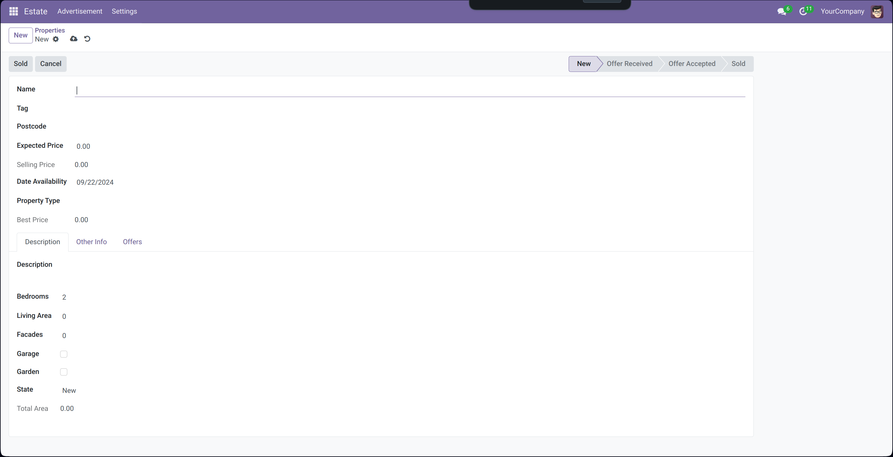
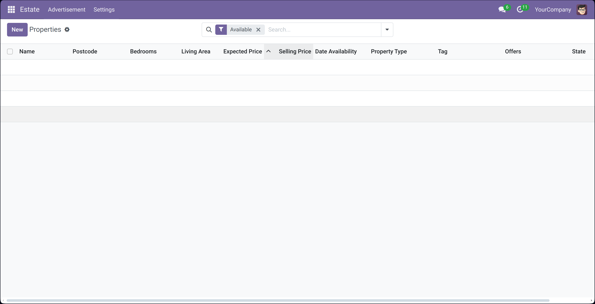
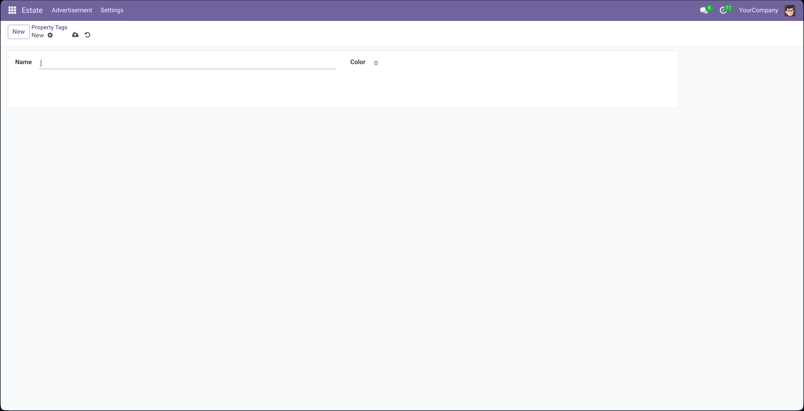
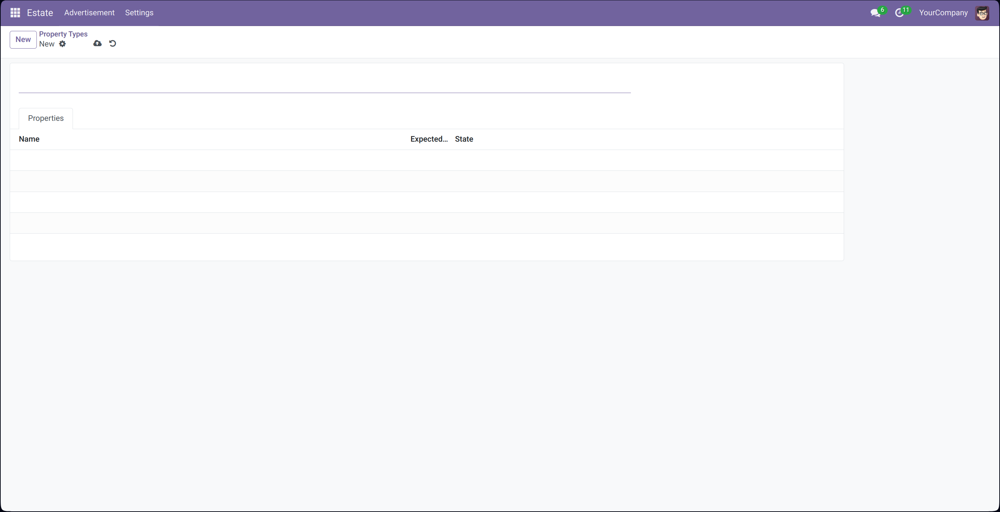

# Real Estate ERP

This project is a tutorial project from Odoo system tailored for the real estate industry. The system is designed to enhance efficiency, improve data accuracy, and provide valuable insights to help real estate businesses make informed decisions.

It has property types, tags, and the description about the property itself.

## Property Form

## Property Tags

## Property Types

